# 🚀 CodeCrack AI

<p align="center">


</p>

**An AI-Powered Coding Interview Preparation Platform**

Practice • Learn • Improve • Crack Your Dream Job

</p>

---

## 📌 About

CodeCrack AI is a full-stack coding interview preparation platform that helps students prepare for technical interviews using Artificial Intelligence.

It combines coding practice, AI-powered feedback, resume analysis, mock interviews, contests, progress tracking, and personalized learning into one platform.

The goal is to provide an experience similar to popular interview preparation platforms while integrating modern AI features.
# 🌐 Live Demo

🚧 Coming Soon...

(Currently preparing deployment on Render.)

---

# ✨ Features

### 💻 Coding Platform

* Online Code Editor
* Run Code
* Submit Solution
* Test Case Evaluation
* AI Code Review
* Smart Hints
* Difficulty Levels
* Company-wise Questions
* Topic-wise Questions

---

### 🤖 AI Features

* 🎤 AI Voice Interview
* 📄 AI Resume Studio
* 🧠 AI Practice Recommendation
* 🤖 AI Code Review
* 💡 Intelligent Hint System

---

### 📈 Progress Tracking

* XP System
* Level System
* Achievement System
* Daily Streak
* Progress Dashboard
* Personalized Roadmap
* Revision Queue

---

### 🏆 Contest System

* Weekly Contest Arena
* Random Question Generation
* Contest Results
* XP Rewards
* Ranking System

---

### 🌍 Community

* Community Feed
* Like Posts
* Public Profile
* Share Coding Journey

---

# 📸 Project Screenshots

## 🏠 Home Dashboard

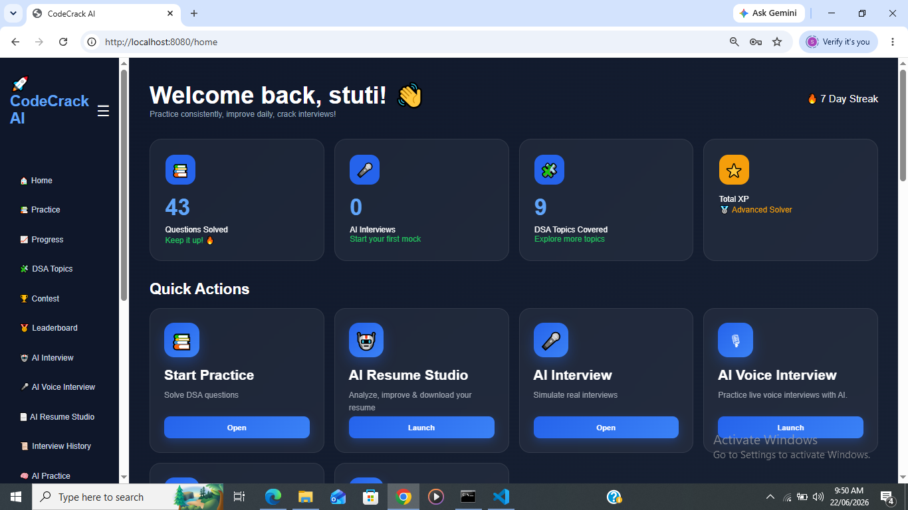

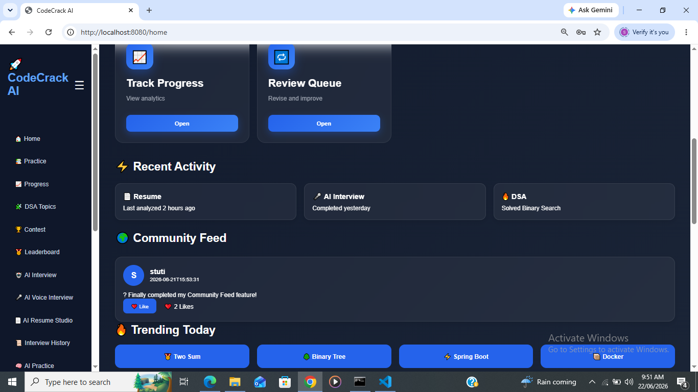

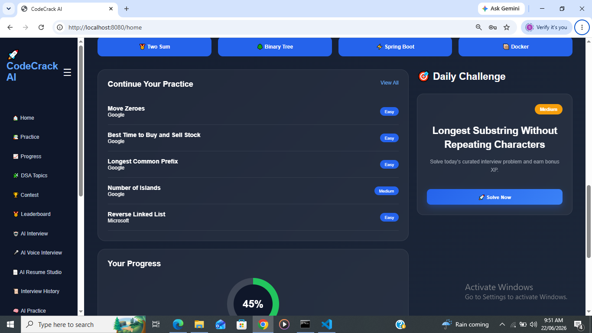

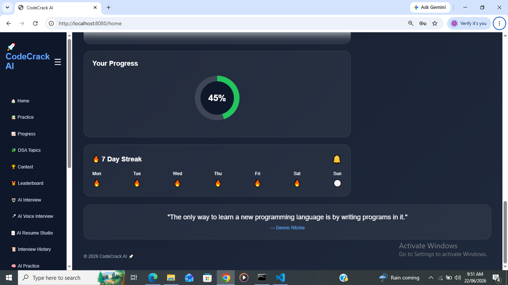

---

## 💻 Practice Questions

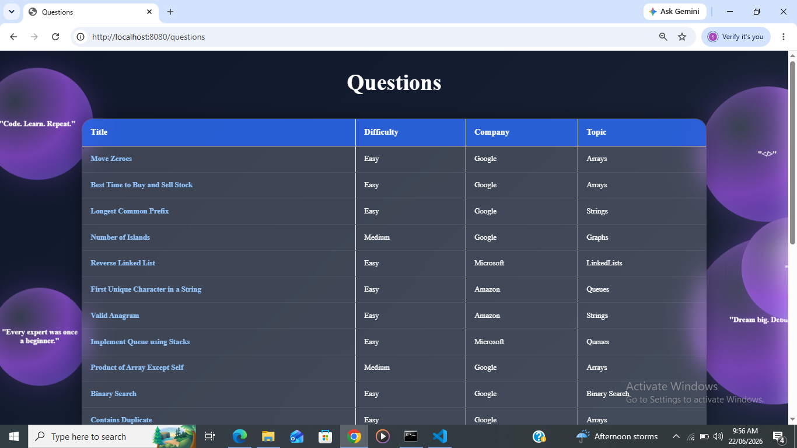

---

## 📊 Progress Dashboard

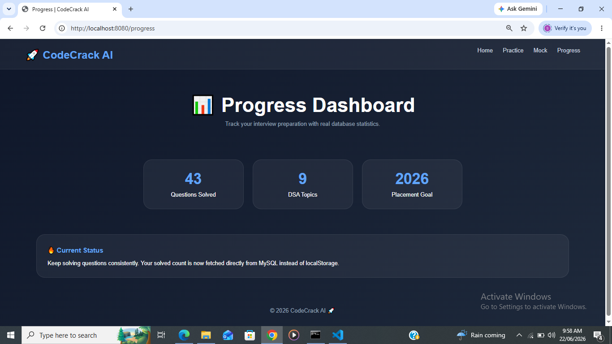

---

## 🏆 Leaderboard

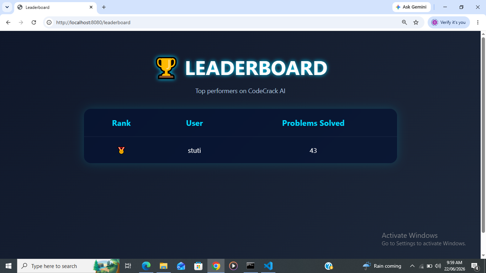

---

## 🌍 Community Feed

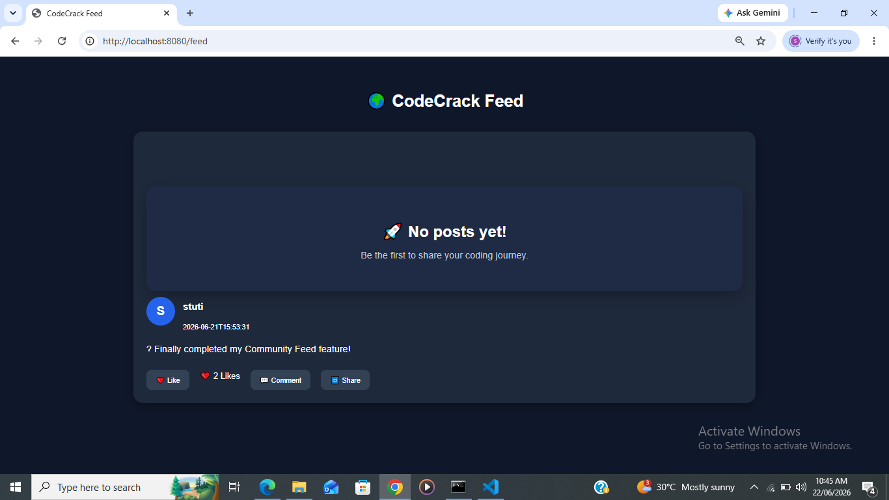

---

## 🎤 AI Voice Interview

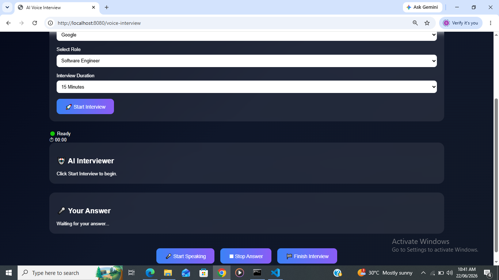

---

## 📄 AI Resume Studio

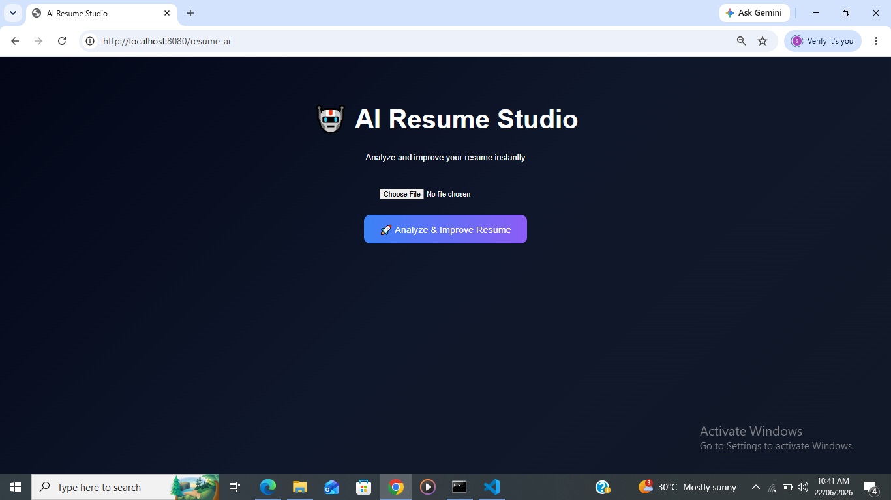

---

## 🏆 Contest Arena

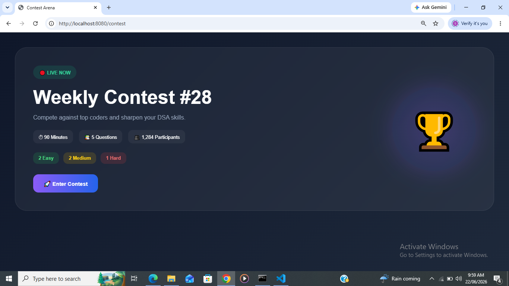

---

# 🛠 Tech Stack

### Backend

* Java
* Spring Boot
* Spring MVC
* Spring Security
* Spring Data JPA

### Frontend

* HTML5
* CSS3
* JavaScript
* Thymeleaf

### Database

* MySQL

### AI

* Groq API

### Tools

* Maven
* Git
* GitHub
* VS Code
* IntelliJ IDEA

---

# ⚙️ Installation

## Clone Repository

```bash
git clone https://github.com/Stuti-creater/CodeCrack-AI.git
```

## Open Project

Open the project in IntelliJ IDEA or VS Code.

## Configure Database

Create a MySQL database and update:

```
application.properties
```

with your database credentials.

## Configure Groq API

Add your own Groq API key:

```
Create an environment variable:

GROQ_API_KEY=YOUR_GROQ_API_KEY
```

## Run Application

```bash
mvn spring-boot:run
```

The application will start at:

```
http://localhost:8080
```

---

# 🚀 Future Enhancements

* Docker-based Code Execution
* Real-Time Contest Ranking
* Live Coding Rooms
* Friends & Messaging
* Notifications
* AI Interview Analytics
* Certificate Generation
* Mobile Application

---

# 📂 Project Structure

```
CodeCrack-AI
│
├── src
├── images
├── README.md
├── pom.xml
└── mvnw
```

---

# 👩‍💻 Author

**Stuti Agrawal**

B.Tech Computer Science Engineering

Passionate about Java, Spring Boot, Artificial Intelligence, and Software Development.

---

# ⭐ Support

If you found this project useful, consider giving it a ⭐ on GitHub.

It motivates me to continue improving CodeCrack AI.
